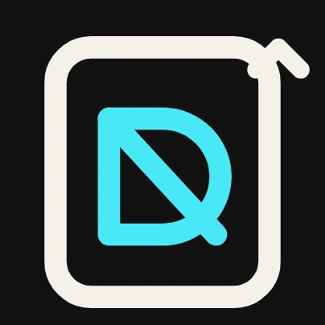
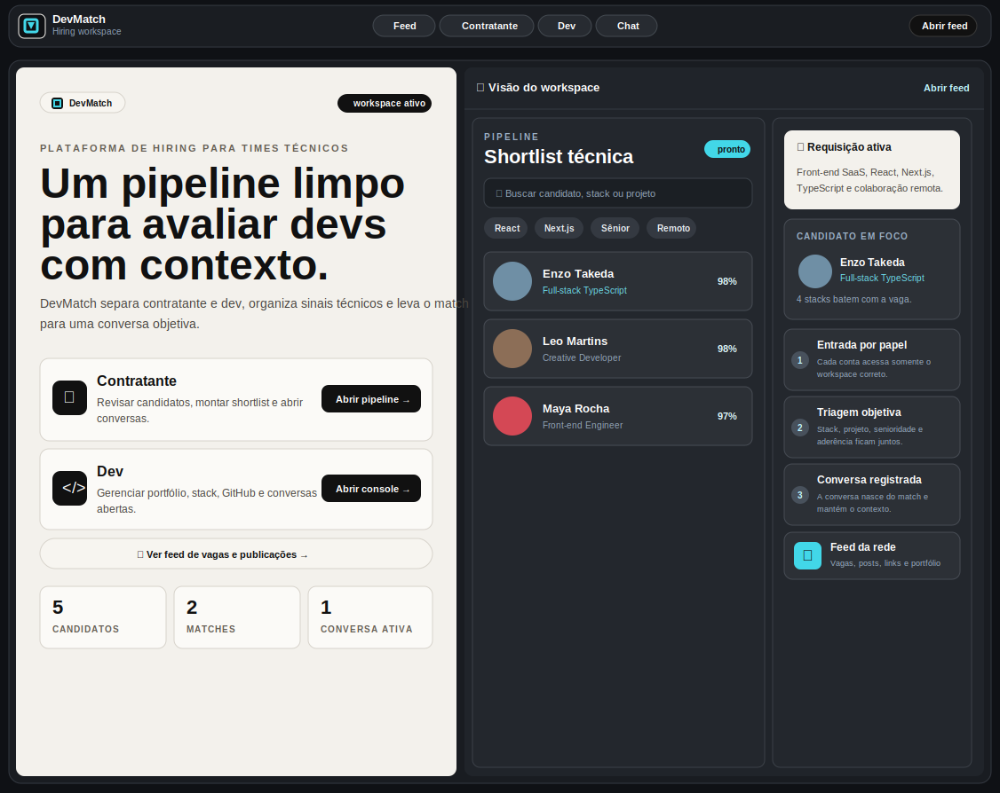

<div align="center">



# DevMatch

### Recrutamento técnico com contexto

Plataforma SaaS full-stack que conecta empresas e desenvolvedores por meio de perfis técnicos, portfólios, projetos, compatibilidade, matches, feed e conversas persistidas.


<br />

<a href="https://wessyu.github.io/DEVMATCH/">
  
</a>

<sub>Clique na imagem para abrir a demonstração.</sub>

</div>

---

## Sobre o produto

O DevMatch foi criado para tornar a avaliação de profissionais de tecnologia mais objetiva.

Em vez de limitar o processo a currículos e descrições genéricas, a plataforma reúne informações relevantes em um único workspace: stack, senioridade, projetos, GitHub, sinais técnicos, disponibilidade e compatibilidade com a vaga.

O objetivo é transformar a triagem em um fluxo claro:

```text
Descoberta → Avaliação → Match → Conversa
```

---

## Experiências por tipo de conta

| Contratante | Desenvolvedor |
|---|---|
| Analisa candidatos e evidências técnicas | Cria e edita o próprio perfil profissional |
| Filtra profissionais por stack | Apresenta stack, projetos e disponibilidade |
| Visualiza compatibilidade com a vaga | Conecta e exibe repositórios do GitHub |
| Salva matches e monta uma shortlist | Participa do feed da comunidade |
| Inicia conversas com contexto | Acompanha matches e conversas |

---

## Principais funcionalidades

- Autenticação para empresas e desenvolvedores
- Workspaces separados por tipo de conta
- Perfis técnicos com stack, senioridade, localização e disponibilidade
- Portfólio com projetos e evidências de entrega
- Leitura de repositórios públicos do GitHub
- Filtros por tecnologia e critérios técnicos
- Pontuação de compatibilidade entre vaga e candidato
- Criação e persistência de matches
- Chat manual associado ao match
- Feed com publicações, vagas, links, imagens e tags
- Persistência de usuários, perfis, matches, mensagens e posts
- Interface responsiva com identidade visual própria
- Versão estática para GitHub Pages e versão full-stack para Vercel

---

## Stack

### Front-end

- Next.js 16 com App Router
- React 19
- TypeScript
- Tailwind CSS 4
- GSAP
- Lucide React

### Back-end

- Next.js Route Handlers
- Neon Serverless PostgreSQL
- Cookies de sessão HTTP-only
- Hash de senhas com `scrypt`
- Validação e sanitização de payloads

### Infraestrutura

- Vercel para a aplicação full-stack
- Neon para persistência PostgreSQL
- GitHub Pages para a demonstração estática

---

## Arquitetura

```text
src/
├── app/
│   ├── api/
│   │   ├── auth/
│   │   ├── chat/
│   │   ├── feed/
│   │   ├── github/
│   │   ├── matches/
│   │   └── profiles/
│   ├── chat/
│   ├── contratante/
│   ├── dev/
│   └── feed/
├── components/
└── lib/
    ├── auth.ts
    ├── db.ts
    ├── devmatch-data.ts
    └── request-guards.ts
```

A aplicação utiliza dados locais como fallback durante o desenvolvimento. Quando `DATABASE_URL` está configurada, os dados são armazenados no Neon PostgreSQL.

---

## Banco de dados

O schema é preparado automaticamente no primeiro acesso ao backend.

| Tabela | Responsabilidade |
|---|---|
| `devmatch_users` | Contas, tipo de usuário e senha protegida |
| `devmatch_profiles` | Perfis técnicos dos desenvolvedores |
| `devmatch_matches` | Conexões entre empresas e candidatos |
| `devmatch_messages` | Mensagens associadas a cada match |
| `devmatch_feed_posts` | Vagas e publicações do feed |

---

## Rotas da API

| Método | Rota | Função |
|---|---|---|
| `POST` | `/api/auth` | Cadastro e login |
| `GET` | `/api/profiles` | Listagem de perfis técnicos |
| `POST` | `/api/matches` | Criação de matches |
| `GET` | `/api/chat?matchId=...` | Carregamento de mensagens |
| `POST` | `/api/chat` | Envio de mensagem |
| `GET` | `/api/feed` | Listagem de publicações e vagas |
| `POST` | `/api/feed` | Criação de uma publicação |
| `GET` | `/api/github?user=...` | Leitura de repositórios públicos |

---

## Executando localmente

### 1. Clone o repositório

```bash
git clone https://github.com/WessYu/DEVMATCH.git
cd DEVMATCH
```

### 2. Instale as dependências

```bash
npm install
```

### 3. Configure as variáveis de ambiente

Crie um arquivo `.env.local` na raiz do projeto:

```env
DATABASE_URL="sua_connection_string_do_neon"
AUTH_SECRET="um_valor_longo_unico_e_seguro"
```

`AUTH_SECRET` é obrigatório em produção. Nunca publique `.env.local`, credenciais ou connection strings reais.

### 4. Inicie o ambiente de desenvolvimento

```bash
npm run dev
```

A aplicação ficará disponível em:

```text
http://localhost:3000
```

---

## Scripts

```bash
npm run dev          # inicia o ambiente de desenvolvimento
npm run build        # gera o build de produção
npm run start        # inicia o build de produção
npm run lint         # executa o ESLint
npm run build:pages  # gera a versão estática do GitHub Pages
```

---

## Deploy

### Vercel

A versão publicada na Vercel utiliza os Route Handlers, autenticação, chat, feed e persistência no Neon.

Variáveis necessárias:

```env
DATABASE_URL="..."
AUTH_SECRET="..."
```

### GitHub Pages

O GitHub Pages publica apenas a versão estática da interface. Recursos que dependem do backend devem ser demonstrados na versão hospedada na Vercel.

---


## Objetivo do projeto

O DevMatch demonstra a construção de um produto full-stack completo, cobrindo interface, experiência do usuário, regras de negócio, autenticação, integração com API externa, banco de dados e deploy.

Mais do que uma landing page, o projeto foi pensado como uma plataforma operacional de recrutamento técnico.

---

## Autor

Desenvolvido por **Wesley Cruz (Wess)**.

[GitHub](https://github.com/WessYu)
